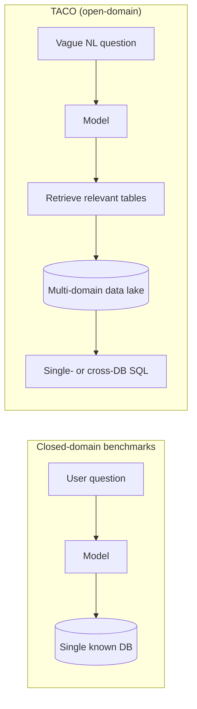
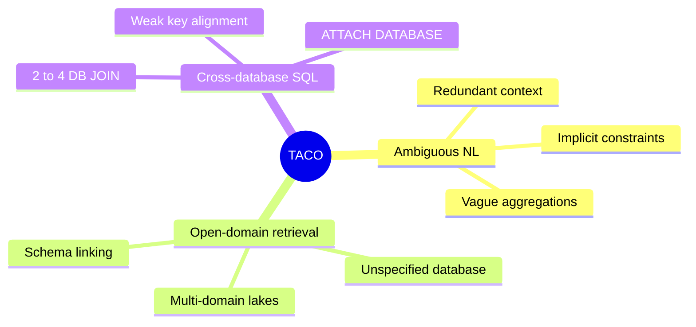
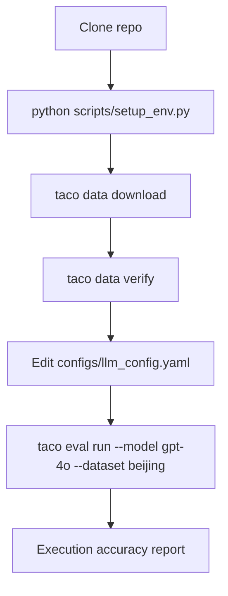
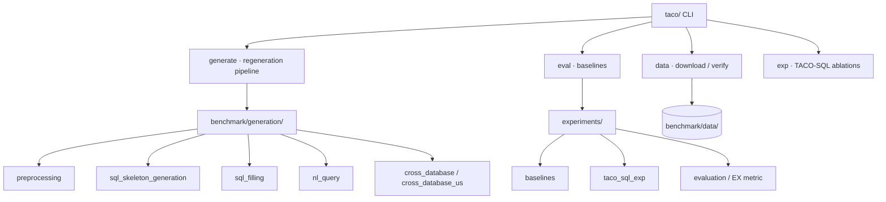
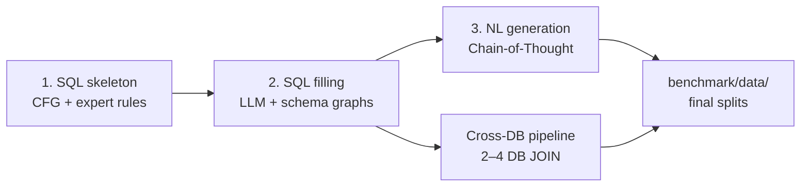

<div align="center">

# TACO-Benchmark

**A benchmark for open-domain Text-to-SQL with ambiguous and cross-database queries**

<br/>

[](https://www.python.org/)
[](LICENSE)
[](https://drive.google.com/file/d/1Ynbv5eyEnM59mlEzqXZZsNh8sdHWH-nb/view?usp=drive_link)

<br/>

**[Overview](#overview)** · **[Dataset](#dataset)** · **[Quick Start](#quick-start)** · **[Examples](docs/EXAMPLES.md)** · **[Experiments](docs/EXPERIMENTS.md)**

</div>

## Overview

**TACO** (Text-to-SQL with **A**mbiguous and **C**ross-database **O**pen-domain queries) evaluates Text-to-SQL systems on real-world **data-lake** scenarios. Unlike closed-domain benchmarks (Spider, BIRD), TACO requires models to handle vague user intent, retrieve tables from heterogeneous lakes, and compose SQL across multiple databases.



### Highlights

| | |
|:--|:--|
| **Scale** | ~14,500 Text-to-SQL instances across 46 SQLite databases |
| **Regions** | TACO-Beijing (24 DBs, Chinese civic data) · TACO-US (22 DBs, US open data) |
| **Challenges** | Ambiguous NL · unspecified target DBs · 2–4 database JOIN/UNION |
| **Gold standard** | Executable SQL with validated execution results |
| **Tooling** | Unified `taco` CLI — data download, regeneration, baselines, ablations |

### Three core challenges



| Challenge | What it tests | Example doc |
|:--|:--|:--|
| **Ambiguous NL** | Redundant context, implicit constraints, vague aggregation requests | [EXAMPLES.md §1](docs/EXAMPLES.md) |
| **Unspecified databases** | Retrieve relevant tables from large heterogeneous lakes | [EXAMPLES.md §2](docs/EXAMPLES.md) |
| **Cross-database SQL** | JOIN / UNION across 2–4 databases with weak relationships | [EXAMPLES.md §3](docs/EXAMPLES.md) |

---

## Dataset

The dataset is distributed separately (not in git):

| Source | File |
|:--|:--|
| [Google Drive](https://drive.google.com/file/d/1Ynbv5eyEnM59mlEzqXZZsNh8sdHWH-nb/view?usp=drive_link) | `taco-benchmark.tar.gz` |

### Subset statistics

| Subset | Databases | Single-DB SQL | Single-DB NL | Cross-DB SQL |
|:--|--:|--:|--:|--:|
| TACO-Beijing | 24 | 4,028 | 5,587 | 466 |
| TACO-US | 22 | 3,990 | 3,990 | 429 |
| **Total** | **46** | **8,018** | **9,577** | **895** |

> **Notes**
> - **~14,500** is the headline count of high-quality Text-to-SQL instances in the benchmark (NL queries with executable gold SQL, including cross-database cases).
> - Single-DB SQL and NL counts can differ within a subset when the two generation stages progress at different rates (e.g., Beijing has more NL than SQL).
> - After downloading, run `python legacy/tools/cross_database/statistics_all_datasets.py` for live counts on your local copy.

### Query-type distribution

Design distribution across the full benchmark (single- + cross-database):

| Query type | ~Count | Share |
|:--|--:|--:|
| Single-database | ~11,700 | 80.5% |
| 2-database cross-DB | ~2,175 | 15.0% |
| 3-database cross-DB | ~638 | 4.4% |
| 4-database cross-DB | ~15 | 0.1% |

Cross-DB breakdown in the **released** SQL artifacts (895 total):

| Cross-DB type | Beijing | US | Total |
|:--|--:|--:|--:|
| 2-database | ~375 | ~345 | ~720 |
| 3-database | ~82 | ~78 | ~160 |
| 4-database | ~9 | ~6 | ~15 |

Details: **[docs/DATASET.md](docs/DATASET.md)**

---

## Quick Start

> Full guide: **[docs/INSTALL.md](docs/INSTALL.md)**



### 1. Install

```bash
git clone https://github.com/Akanezora0/TACO-Benchmark.git
cd TACO-Benchmark
python scripts/setup_env.py    # or: bash setup_env.sh
source .venv/bin/activate
```

### 2. Download data

```bash
taco data download
taco data verify
```

### 3. Configure LLM (for experiments / regeneration)

```bash
# Edit API settings (templates created by setup_env.py)
vim configs/llm_config.yaml
```

### 4. Load an example

```python
import json
from pathlib import Path

files = list(Path("benchmark/data/beijing/output/single").glob("*/*.json"))
example = json.loads(files[0].read_text(encoding="utf-8"))
print(example["natural_language_query"])
print(example["sql"])
```

### 5. Run a baseline experiment

```bash
taco eval run --model gpt-4o --dataset beijing
# or minimal repro:
bash examples/quick_eval.sh
```

See **[docs/EXPERIMENTS.md](docs/EXPERIMENTS.md)** for the CLI reference and **[experiments/README.md](experiments/README.md)** for the full framework.

---

## Repository map



```text
TACO-Benchmark/
├── taco/                      # CLI (taco data · generate · eval · exp)
├── benchmark/
│   ├── data/                  # Dataset — download via taco data (gitignored)
│   └── generation/            # Regeneration pipeline
├── experiments/               # Baselines, ablations, execution accuracy
├── legacy/                    # Archived scripts + maintenance tools
├── docs/                      # User guides (see docs/README.md)
├── examples/                  # quick_eval.sh
├── configs/                   # *.example templates
└── scripts/                   # setup_env, download_dataset
```

Architecture details: **[docs/ARCHITECTURE.md](docs/ARCHITECTURE.md)**

---

## Data generation pipeline

Benchmark data is produced in three stages:



1. **SQL skeleton generation** — CFG rules + expert examples
2. **SQL content filling** — LLM fills placeholders using schema-linking graphs
3. **NL query generation** — Chain-of-Thought NL from SQL

Scripts live under `benchmark/generation/`. Regeneration requires an LLM API.

Full guide: **[docs/GENERATION.md](docs/GENERATION.md)**

---

## CLI

```bash
taco --help
taco info

# Dataset
taco data download
taco data verify

# Data generation (requires LLM API)
taco generate single-db --database Housing --target-count 200 --region beijing
taco generate cross-db --region beijing
taco generate status --region beijing

# Baseline evaluation
taco eval run --model gpt-4o --dataset beijing
taco eval batch --models gpt-4o,gpt-4o-mini --dataset beijing
taco eval report --pred experiments/results/baseline_gpt_4o_taco_beijing.json

# TACO-SQL ablations & batch baselines
taco exp baseline --model gpt-4o --dataset beijing
taco exp ablation --setting qr_tl_qp --model gpt-4o --dataset beijing
taco exp run-all --dataset beijing --base-llm

# Legacy per-database evaluation (custom paths)
taco eval legacy-db --database Housing --model gpt-4o --region beijing
```

`--dataset` accepts shorthand (`beijing` → `taco_beijing`). Test split default: `benchmark/data/final/{dataset}/test.json`.

---

## Documentation

| Doc | Contents |
|:--|:--|
| [docs/README.md](docs/README.md) | Documentation index and layering guide |
| [docs/INSTALL.md](docs/INSTALL.md) | Environment setup, API config, troubleshooting |
| [docs/DATASET.md](docs/DATASET.md) | Download, layout, JSON formats |
| [docs/GENERATION.md](docs/GENERATION.md) | Data regeneration pipeline |
| [docs/EXPERIMENTS.md](docs/EXPERIMENTS.md) | Baselines, ablations, CLI reference |
| [docs/EXAMPLES.md](docs/EXAMPLES.md) | Challenge examples with NL/SQL pairs |
| [docs/ARCHITECTURE.md](docs/ARCHITECTURE.md) | Repo layout and change boundaries |
| [CONTRIBUTING.md](CONTRIBUTING.md) | Contribution guidelines |
| [examples/README.md](examples/README.md) | Quick reproduction scripts |

## Requirements

- Python **3.10+**
- See `requirements.txt` (core) · `requirements-eval.txt` · `requirements-sft.txt`
- LLM API access for regeneration and API-based baselines

## Citation

If you use TACO-Benchmark in your research, please cite:

```bibtex
@misc{taco_benchmark,
  title  = {TACO: A Benchmark for Open-Domain Text-to-SQL with Ambiguous and Cross-Database Queries},
  author = {TACO-Benchmark Contributors},
  year   = {2026},
  url    = {https://github.com/Akanezora0/TACO-Benchmark}
}
```

## License

This project is released under the [MIT License](LICENSE).
